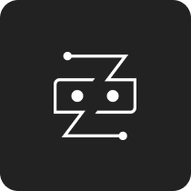

<h1 align="center">ZUMA AI</h1>

<strong>Project Started: </strong>
Thursday, 25 Mey 2023

<strong>Project End: </strong>
Thursday, 25 Mey 2023

A Personal Artificial Intelligence that can help you to answer whatever you ask because it is powered by Open AI using their own API.

Currently still in the development stage. In the future, it is hoped that ZUMA AI will be able to control home appliances using IOT and be able to decorate your desk.
  

<strong>Note: </strong><i>This project contains lots of folders because I documented all my learning journey in building this project here.</i>

